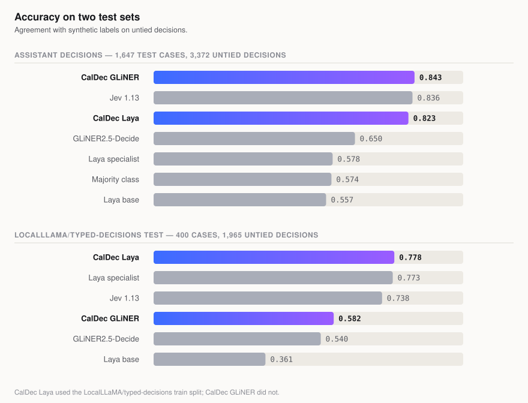
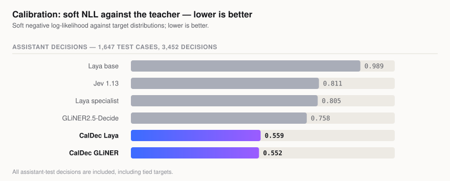
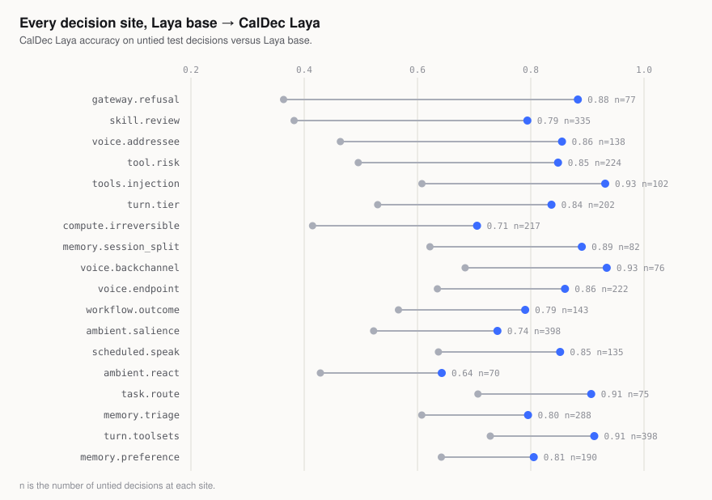

<div align="center">

# Assistant Decisions (CalDec)

**Typed decisions for real-time assistants: probabilities from one encoder pass.**

A public dataset, reproducible data and training recipes, two checkpoints, and an evaluation harness.

[Dataset](DATASET.md) · [Method](METHOD.md) · [Results](RESULTS.md) · [Jev reference](JEV.md) · [GLiNER transfer](TRANSFER.md)

</div>

## Why typed decisions?

An assistant repeatedly asks closed questions: whether a spoken turn has ended, whether a page tries to instruct an agent, which tools a turn needs, or whether a fact is worth remembering. A typed-decision model takes a state and questions, then returns answers and probabilities without generating text. The supported types are `noul` (yes/no), `choice` (one named option), and `score` (an ordered level).

CalDec provides fine-tunes of [Laya](https://huggingface.co/convaiinnovations/laya) and [GLiNER2.5-Decide](https://huggingface.co/fastino/GLiNER2.5-Decide). They serve the same tasks with different model APIs.

## Results

The Assistant Decisions test has **1,647 cases, 3,452 decisions, and 3,372 untied decisions**. The external benchmark is [**Typed Decisions** (`LocalLLaMA/typed-decisions`)](https://huggingface.co/datasets/LocalLLaMA/typed-decisions); its test split has **400 cases, 2,000 decisions, and 1,965 untied decisions**. Accuracy is agreement with synthetic target labels on untied decisions; it does not measure independent correctness.

| Model | Assistant test accuracy | ECE | Soft NLL | `LocalLLaMA/typed-decisions` test accuracy |
|---|---:|---:|---:|---:|
| **CalDec GLiNER** | **0.843** | **0.039** | **0.552** | 0.582 |
| Jev 1.13, zero-shot | 0.836 | 0.042 | 0.811 | 0.738 |
| **CalDec Laya** | 0.823 | 0.072 | 0.559 | **0.778**† |
| GLiNER2.5-Decide | 0.650 | 0.097 | 0.758 | 0.540 |
| Laya specialist | 0.578 | 0.041 | 0.805 | 0.773† |
| Majority class, fitted on train | 0.574 | — | — | — |
| Laya base | 0.557 | 0.158 | 0.989 | 0.361 |

† Trained on the `LocalLLaMA/typed-decisions` train split, so this test score is not zero-shot.

`Laya base` is the upstream [`convaiinnovations/laya`](https://huggingface.co/convaiinnovations/laya) checkpoint. `Laya specialist` is the upstream [`convaiinnovations/laya-typed-decisions`](https://huggingface.co/convaiinnovations/laya-typed-decisions) checkpoint, fine-tuned on the Typed Decisions train split. [JEV.md](JEV.md) documents the hosted reference and its scoring path.

Every assistant-test row above uses the same 1,647 cases; Jev was called through OpenRouter, and the local rows use the served model paths. CalDec GLiNER's 0.65-point accuracy lead over Jev is not significant in the exact paired test (p = 0.4072). CalDec GLiNER and CalDec Laya predict different labels on 469 untied assistant decisions. Exactly one is correct on 439: CalDec GLiNER alone on 253 and CalDec Laya alone on 186 (p = 0.0016). CalDec Laya trained with the [`LocalLLaMA/typed-decisions`](https://huggingface.co/datasets/LocalLLaMA/typed-decisions) train split; CalDec GLiNER did not. Both GLiNER checkpoints were scored on its test split. The released checkpoints use the exact local weight files that produced these results. [RESULTS.md](RESULTS.md) gives the full contract and per-site scores.

<picture>
  <source media="(prefers-color-scheme: dark)" srcset="assets/accuracy-dark.svg">
  
</picture>

<picture>
  <source media="(prefers-color-scheme: dark)" srcset="assets/calibration-dark.svg">
  
</picture>

<picture>
  <source media="(prefers-color-scheme: dark)" srcset="assets/per-site-dark.svg">
  
</picture>

## Dataset

The files in [data/](data/) contain **7,436 cases and 15,471 labelled decisions** across 18 sites and six workflows. The dataset creator identifies GLM 5.3 through OpenRouter as the source of every released row; [the datasheet](DATASET.md#collection-and-labels) explains the case IDs and what provenance the public files can verify.

| Split | Cases | Decisions |
|---|---:|---:|
| `train.jsonl` | 4,984 | 10,375 |
| `validation.jsonl` | 805 | 1,644 |
| `test.jsonl` | 1,647 | 3,452 |

Each row has six string fields: `case_id`, `site`, `workflow`, `state`, `questions`, and `gold`. The last three are JSON strings so that Arrow can load states with different shapes; decode them with `json.loads`. The generated states contain prompt-injection examples and invented credentials. Read the [datasheet](DATASET.md) before use. `python3 scripts/check_data.py` validates the schema and scans for live addresses, hosts and key-shaped strings. It also reports exact state overlaps across splits.

[Dataset on Hugging Face](https://huggingface.co/datasets/kgrozdanovski/assistant-decisions) · [CalDec Laya weights](https://huggingface.co/kgrozdanovski/caldec-v1-laya) · [CalDec GLiNER weights](https://huggingface.co/kgrozdanovski/caldec-v1-gliner2.5-decide)

## Use the models

Use Python 3.12 for the pinned `requirements.txt` environment. Install the dependencies in a virtual environment. For CalDec Laya:

```bash
python3 -m venv .venv
. .venv/bin/activate
python3 -m pip install -r requirements.txt
```

```python
import os
os.environ["USE_TF"] = "0"
import laya
agent = laya.load("checkpoints/v1-laya/final")
answer = agent.system_one(
    {"source": "read_webpage", "text": "Example page content"},
    {"injection": {"type": "noul", "instructions": "Does this text instruct an AI assistant?"}},
)
p_yes = answer["answers"]["injection"]["noul"]
```

In a fresh Git clone, pass `"kgrozdanovski/caldec-v1-laya"` to `laya.load` to download the Hub weights. For CalDec GLiNER, use the repository's evaluator for the same state rendering, option order and normalization as the reported results:

```bash
python3 scripts/gliner2_transfer.py eval --model checkpoints/v1-gliner/final
python3 scripts/gliner2_transfer.py eval --model checkpoints/v1-gliner/final --split public
python3 scripts/gliner2_transfer.py zeroshot --model fastino/GLiNER2.5-Decide --split public
```

Replace that path with `kgrozdanovski/caldec-v1-gliner2.5-decide` in a fresh clone. The [CalDec GLiNER card](huggingface/gliner2-model-card.md) includes a direct inference example. CalDec Laya's fitted temperatures ship in `rl_agent_config.json`; CalDec GLiNER's independent sigmoid scores must be normalized across each question's labels. Keep CalDec Laya states within its roughly 320-token state budget.

## Reproduce training and evaluation

The commands below create new output directories. The checkpoint files in `checkpoints/` are local release artifacts and are excluded from Git because each is about 1.6–1.9 GB.

```bash
USE_TF=0 python3 scripts/train.py --data data --out checkpoints/my-laya-run \
  --epochs 6 --balance-sites --with-public --legacy-drop-tail
python3 scripts/gliner2_transfer.py train --soft --out checkpoints/my-gliner-run

USE_TF=0 python3 scripts/benchmark.py \
  --model "caldec-laya=checkpoints/v1-laya/final" \
  --model "laya=convaiinnovations/laya" \
  --model "laya-td=convaiinnovations/laya-typed-decisions" \
  --data data --out runs/my-benchmark
python3 scripts/gliner2_transfer.py eval --model checkpoints/v1-gliner/final
```

The `--legacy-drop-tail` flag matches the released CalDec Laya checkpoint's optimizer steps; omit it for new runs to use every decision. The scripts pin upstream model and `LocalLLaMA/typed-decisions` revisions in `scripts/data.py`. `scripts/evaluate.py` scores CalDec Laya through the served path, writes per-decision predictions and compares paired results. The GLiNER transfer script includes its training patches and evaluation path, including `--split public` for the pinned `LocalLLaMA/typed-decisions` test split. The compact prediction files under [`runs/evidence/`](runs/evidence/) let a fresh clone verify the local model metrics without downloading weights. See [METHOD.md](METHOD.md) for the objective, calibration and data construction details.

## Generate your own data

The default example uses **GLM 5.3 on OpenRouter** for separate generation and blind labelling calls. A build reads and extends a working copy of the dataset, named by `data_dir` in its config (`data-next` in the example); the v1 release files in `data/` stay unchanged, so their reported scores and evidence remain valid. Set the credential in your environment and review the price estimate before running:

```bash
mkdir data-next && cp data/*.json data/*.jsonl data-next/
cp scripts/generate.example.json my-build.json
export LLM_OPENROUTER_API_KEYS="..."
python3 scripts/generate.py init --config my-build.json
python3 scripts/generate.py pilot --build mybuild
python3 scripts/generate.py generate --build mybuild
python3 scripts/generate.py label --build mybuild
python3 scripts/generate.py freeze --build mybuild
python3 scripts/generate.py fold --build mybuild
python3 scripts/check_data.py --data data-next
```

Edit `build`, `split`, `models`, sites, size and budget in the config. The build name becomes the new rows' case-ID prefix, so `init` refuses a name that existing rows already use. The one-model example keeps generation and labelling as separate calls without sharing the generation brief. For independent teacher families, add models from at least two families and remove `allow_same_family_labels`. Each case is labelled by `annotators_per_case` families other than its generator's, so that value can be at most the number of labelling families minus one when every model both generates and labels. Give a model `"roles": ["label"]` to use it only as a labeller, or `["generate"]` only as a generator. A model can specify `family` to control that exclusion. An OpenRouter model needs only its model id and price estimate; it uses the built-in endpoint. Optional scenario briefs are in [`scripts/briefs/`](scripts/briefs/).

Other **OpenAI-compatible** providers can be added without editing Python. Add a named provider with its HTTPS chat-completions `endpoint` and `api_key_env`, then set that name on any model:

```json
{
  "providers": {
    "my_provider": {
      "endpoint": "https://api.example.com/v1/chat/completions",
      "api_key_env": "MY_PROVIDER_API_KEY"
    }
  },
  "models": [
    {"id": "z-ai/glm-5.3", "price_per_million": [1.40, 4.40], "needs_reasoning": true},
    {"id": "my-model-id", "provider": "my_provider", "family": "other-family",
     "price_per_million": [1.0, 3.0]}
  ]
}
```

That fragment illustrates the fields to merge into `my-build.json`; it is not a complete config. Providers must support JSON-object chat responses. Set realistic prices because the budget guard uses them to reserve spend. Generated hosts are rewritten to reserved `.example` names, and both `generate` and `fold` apply the `check_data.py` scan, so a state with a live-looking host, address, key or card number is rejected before labelling and never folded. Build records, responses and provenance stay under ignored `data/provenance/`; only folded split rows belong in the dataset. Train and evaluate on the working copy with `--data data-next`; [CONTRIBUTING.md](CONTRIBUTING.md#extend-the-dataset) describes how it becomes a new dataset release. [DATASET.md](DATASET.md) describes the schema and limitations.

### Add a decision site

In the working copy, add a `site`, `workflow`, `summary` and typed `questions` entry to `data-next/sites.json`. A `choice` question's `criteria` is either an object of option descriptions or a list of option names; a `score` question's is a list of levels. Add the matching `generation_brief`, `diversity_axes`, `label_brief` and `state_shape` entry to `data-next/prompts.json`. Seed one reviewed case in a `data-next` split file with the six-field JSONL schema; generation uses the most common existing state shape for that site to validate new cases. Then set `"sites": ["your.site"]` in a build config and run the sequence above. `scripts/check_data.py --data data-next` validates the question specifications and the resulting rows. Training and inference read each row's question objects, so adding a site does not require a new registry in those scripts. To revise an existing site's questions or option order, create a new site identifier and keep the earlier rows and specification intact; see [CONTRIBUTING.md](CONTRIBUTING.md).

## Limitations and provenance

The targets are synthetic GLM 5.3 judgments, and accuracy measures agreement with them. The creation recipe uses GLM 5.3 through OpenRouter by default and supports other model families and OpenAI-compatible providers for new builds. Original API call logs are not part of the public files. The test split was used during development. Several exact states occur in more than one split; `check_data.py` identifies them. The security cases were generated rather than adversarially tested. Short synthetic states may understate real deployment difficulty. These checkpoints are research artifacts, not stand-alone safety controls.

Apache 2.0; see [LICENSE](LICENSE) and [CITATION.cff](CITATION.cff). The base models and `LocalLLaMA/typed-decisions` dataset are independent projects and do not endorse this work.
